# 👋 Hi, I'm Mohammed Halith

### 🎓 Artificial Intelligence & Data Science Student | 💻 AI & Data Science Enthusiast

---

## 🚀 About Me

I'm an Artificial Intelligence and Data Science student passionate about building practical solutions using AI, Machine Learning, and Python.

- 🔭 Currently working on AI and Python projects
- 🌱 Learning Machine Learning, Data Science, and Deep Learning
- 💡 Interested in Artificial Intelligence and real-world problem solving
- 🛠️ Enjoy building projects and learning new technologies
- 🎯 Goal: Become an industry-ready AI Engineer

---

## 🛠️ Tech Stack

### 💻 Programming Languages

### 📊 Data Science & AI

### ⚙️ Tools

---

## 🚀 Featured Projects

- [AI Hand Gesture Recognition](https://github.com/mohammedhhalith/AI-HAND-GESTURE-RECOGNITION)  
  Hand gesture recognition using Python, OpenCV, and MediaPipe.
- [Data-Cleaning-Visualising-Project](https://github.com/mohammedhhalith/Data-Cleaning-Visualization-Project)  
  A Python project for cleaning, preprocessing, and visualizing datasets using Pandas and Matplotlib.
- [Predictive-Modeling-Using-Machine-Learning](https://github.com/mohammedhhalith/Predictive-Modeling-Using-Machine-Learning)  
  Build a model to predict outcomes based on given data.
- [Exploratory-Data-Analysis-EDA-Project](https://github.com/mohammedhhalith/Exploratory-Data-Analysis-EDA-Project)  
  An exploratory data analysis project using Python to analyze datasets, discover patterns, and generate meaningful insights through visualization.
- [Real-world-Data-Project](https://github.com/mohammedhhalith/Real-world-Data-Project-)  
  This project focuses on analyzing real world data and building a machine learning model to predict the exact values. 

---

## 📊 GitHub Stats

⭐ Thanks for visiting my profile!
